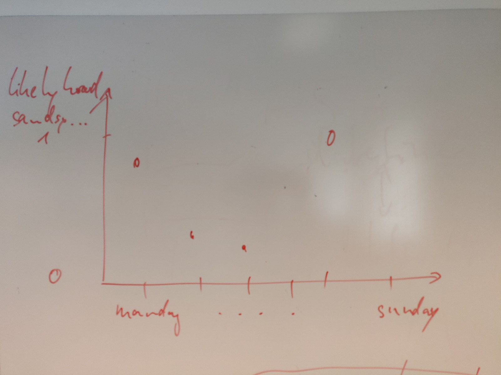
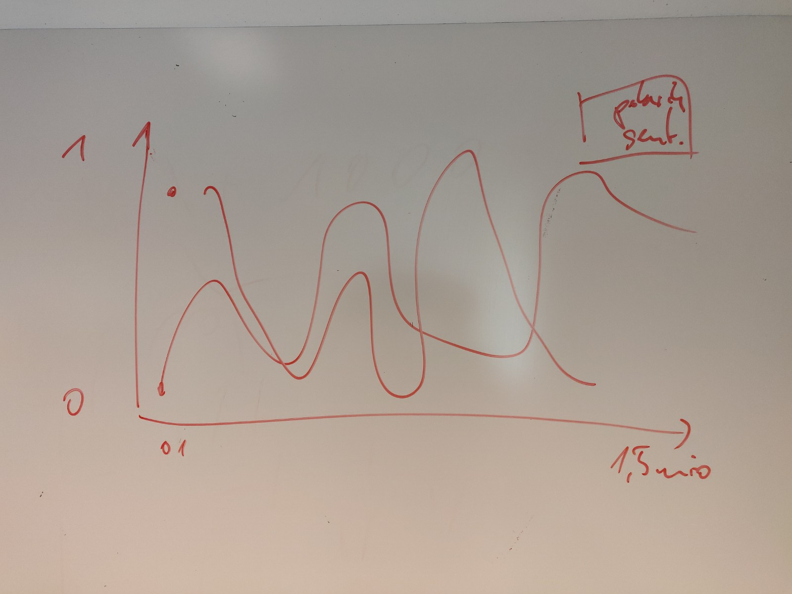
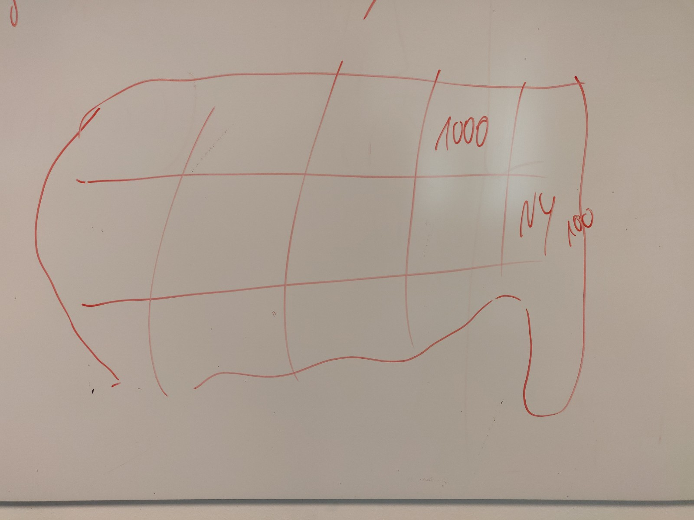

# Python Assignment 4 : UFO reports from USA


## Assignment: UFO reports from USA - https://github.com/BoMarconiHenriksen/impossibleCollegeDataset/blob/master/README.md

## Group
Foolish Supermarket - Alexander (cph-ah353), Stanislav (cph-sn186), Mathias B. (cph-mb493), Mikkel L. (cph-ml474)

## Project Deescription
This is a program written to interact with a specific dataset.
URL to the dataset is in the code and is (https://github.com/planetsig/ufo-reports/raw/master/csv-data/ufo-scrubbed-geocoded-time-standardized.csv)

## How to run (from CLI)
In root of folder, in your terminal of choice, write:

> First install TextBlob library
```$pip install -U textblob ```
> Then install folium
```$conda install -c conda-forge folium```

> To run project
```python main.py```


## Results

### Tasks:
1. Hvilket sted er der flest UFO observationer?

2. Hvordan har antallet af observationer udviklet sig over tid?
    >Som besvarelse til det her spørgsmål vil det give god mening at lave et plot. Det er valgfrit, hvordan i laver plottet.

3. Hvornår på året er der flest observationer?

4. Hvordan ser en ufo ud?
    >Find flere buzzwords som f.eks. form, farve eller andet. Her kan det være en fordel at bruge textBlob. https://textblob.readthedocs.io/en/dev/

5. Hvor lang tid kunne de se ufoen(gennemsnit)?

### Plots:

6. På hvilke dage er det sandsynligt at se ufoer(i procentvis fordeling)?
x i plottet er mandag til søndag.
y i plottet er 0 til 1.

>Hints:
>Hvor mange ufo sightings er der i alt?
>Brug datetime når du skal finde dagene.



7. Lav en graf over polaritet og sentiment.
x i plottet er index over observationer.
y i plottet er 0 til 1.

>Hints:
>Brug textBlob.
>Får i minus tal så normaliser(fjern minus) tallene.
    
[TextBlob](https://textblob.readthedocs.io/en/dev/)

[TextBlob Docs](https://textblob.readthedocs.io/en/dev/quickstart.html#sentiment-analysis)



8. Lav et plot, der viser antallet af ufo observationer pr stat i USA, og farvekode jeres resultat. Mørk farve indiker mange observationer, og lys farve indiker få observationer.

>Brug evt. følgende moduler. Har du kendskab til andre moduler må du gerne bruge dem.
https://pypi.org/project/folium/

>State Boundaries:
https://github.com/jgoodall/us-maps
https://bubinga.co/geojson-us-states-and-counties/

