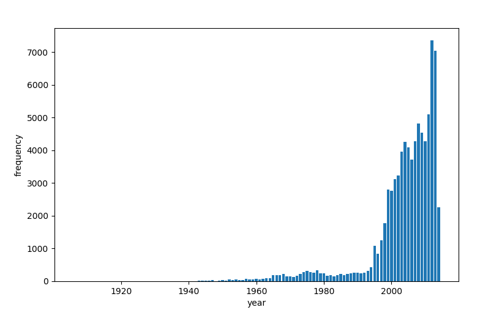
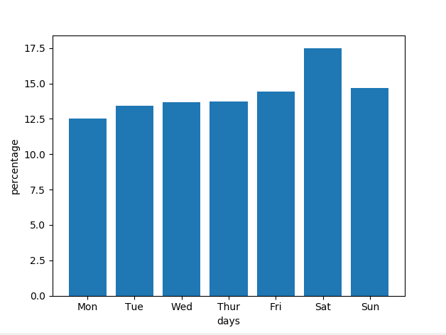
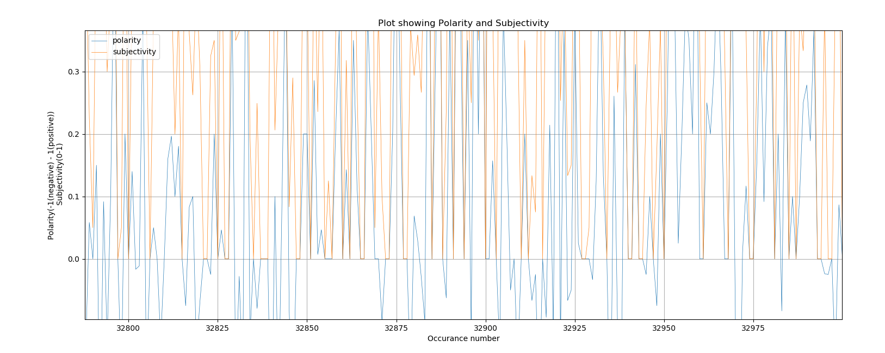
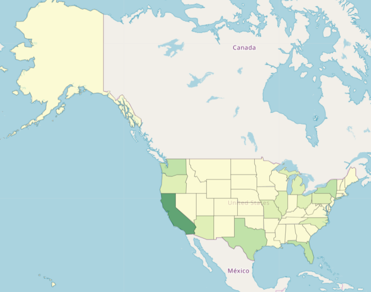

# Python Assignment 4 : UFO reports from USA


## Assignment: UFO reports from USA - https://github.com/BoMarconiHenriksen/impossibleCollegeDataset/blob/master/README.md

## Group
Foolish Supermarket - Alexander (cph-ah353), Stanislav (cph-sn186), Mathias B. (cph-mb493), Mikkel L. (cph-ml474)

## Project Description
This is a program written to interact with a specific dataset.
URL to the dataset is in the code and is (https://github.com/planetsig/ufo-reports/raw/master/csv-data/ufo-scrubbed-geocoded-time-standardized.csv)

## How to run (from CLI)
In root of folder, in your terminal of choice, write:

> First install TextBlob library
```$pip install -U textblob ```

> Then install folium
```$conda install -c conda-forge folium```

> To run project
```python main.py```


## Results
1. Stedet med flest UFO obserervationer er seattle med 525 observationer
2. Se plot

    
3. Måneden med flest observationer er ['July', 9520]
4.  - light mentioned: 16565 times
    - triangle mentioned: 7865 times
    - circle mentioned: 7608 times
    - fireball mentioned: 6208 times
    - other mentioned: 5649 times
    - unknown mentioned: 5584 times
    - sphere mentioned: 5387 times
    - disk mentioned: 5213 times
    - oval mentioned: 3733 times
    - formation mentioned: 2457 times
5. Gennemsnitlig UFO set tid: 13 minutes and 39 seconds
6. Se plot

    
7. Se plot

    
8. Se plot

    